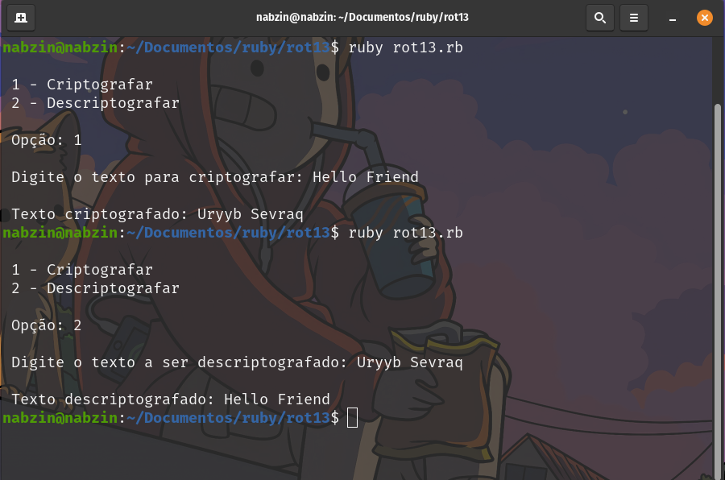

# rot13

ROT13 (rotate by 13 places) é uma cifra de substituição simples usada na criptografia clássica. Ela funciona substituindo cada letra do alfabeto pela letra que está 13 posições à frente dele. Se passar do final do alfabeto, continua-se a contagem a partir do início do alfabeto. Por exemplo, 'A' se torna 'N', 'B' se torna 'O', e assim por diante.
 
Em alguns CTF (Capture the flag) o rot13 é muito utilizado, para não perder tempo com um código estenso de descriptografia, decidi criar o programa rot13 para facilitar o CTF.

## Funcionalidades

Principais funcionalidades do rot13.

- Criptografar
- Descriptografar

## Utilização

ruby rot13.rb

### Pré-requisitos

ruby
